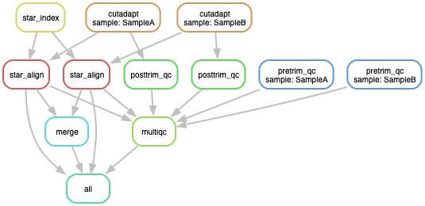

# Gencode_microRNA-seq
microRNA-seq workflow utilizing STAR to generate a Sample-Gene read count matrix

## I. Description
Major steps in the workflow include:
1) Trimming of adapters and low-quality reads using Cutadapt and only reads with lengths of 15-31 nt were kept
2) Generating QC reports using FastQC and aggregating results using MultiQC
3) Aligning trimmed reads to GRCh38 human reference genome (illumine iGenomes NCBI GRCh38) using STAR, and microRNA reads count was quantified according to GENCODE V24 genome annotation file which was the microRNA subset from comprehensive GENCODE annotations.
4) Merging reads-count tables of all samples


## II. Dependencies
* [Snakemake](https://snakemake.readthedocs.io/en/stable/)

**Docker Containers**
* [Cutadapt](https://cutadapt.readthedocs.io/en/stable/)
* [FastQC](https://www.bioinformatics.babraham.ac.uk/projects/fastqc/)
* [MultiQC](https://multiqc.info)
* [STAR](https://github.com/alexdobin/STAR)
* [R](https://www.r-project.org)
## III. Input
* merged fastq files stored in directory: `merged_fastq`
* `adapters.fa` with adapter sequences
* reference genome sequence and annotation files
* microRNA annotation file
* `config.json` with updated file locations
## IV. Output
* Trimmed reads in directory: `trimmed/`
* QC reports of pre-trimmed reads in direcotry: `pretrim_qc/`
* QC reports of post-trimmed reads in direcotry: `posttrim_qc/`
* STAR index in directory: `star_index/`
* STAR alignent results and statistics reports in directory : `star_align/`
* merged reads-count table: `reads_count/reads_count.csv`

## V. Running the workflow
1. Update `config.json` file with the following:
    - reference fasta
    - reference annotation
    - adapters fasta file (optional)
    - miRNA annotations (optional)

2. Run singularity

Example: running on CCAD2 cluster
```
module load slurm
module load singularity
module load conda

conda activate snakemake

mkdir -p singularity_cache

snakemake \
    --use-singularity \
    --singularity-prefix singularity_cache \
    --keep-going \
    --local-cores $SLURM_CPUS_PER_TASK \
    --jobs 10 \
    --slurm \
    --max-jobs-per-second 1 \
    --max-status-checks-per-second 0.01 \
    --latency-wait 120 all
```
## VI. Working directory structure
```bash
.
├── adapters.fa
├── log
│   └── log files
├── merged_fastq
│   └── {sample}.fastq.gz
├── merge.R
├── posttrim_qc
│   ├── posttrim_qc_multiqc_report.html
│   ├── {sample}.trim_fastqc.html
│   └── {sample}.trim_fastqc.zip
├── pretrim_qc
│   ├── pretrim_qc_multiqc_report.html
│   ├── {sample}_fastqc.html
│   └── {sample}_fastqc.zip
├── reads_count
│   └── reads_count.csv
├── sample_names.txt
├── Snakefile
├── star_align
│   ├── log
│   │   ├── {sample}Log.final.out
│   │   └── star_align_multiqc_report.html
│   └── {sample}
│       ├── {sample}Aligned.sortedByCoord.out.bam
│       ├── {sample}Log.final.out
│       ├── {sample}ReadsPerGene.out.tab
│       └── other star output files
├── star_index
│   ├── ENCFF628BVT.gtf
│   ├── gencode.v24.primary_assembly.annotation-tRNAs-ERCC_phiX.gtf
│   └── other index files
└── trimmed
    ├── {sample}_too_long.fastq.gz
    ├── {sample}_too_short.fastq.gz
    ├── {sample}.trim.fastq.gz
    └── {sample}.trim.log
```
